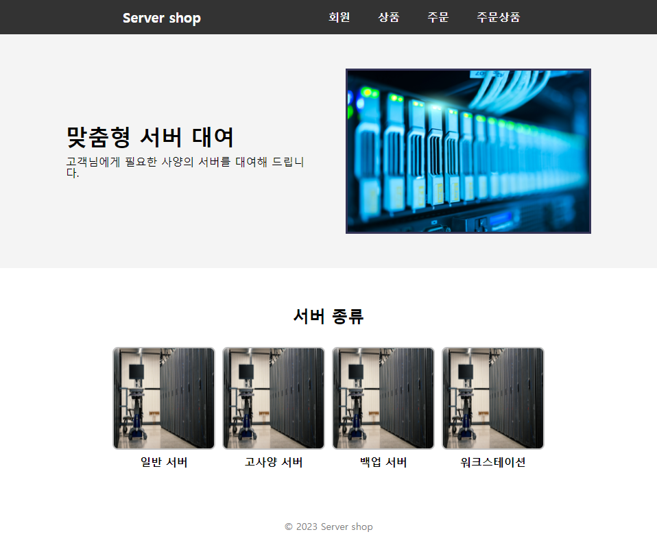
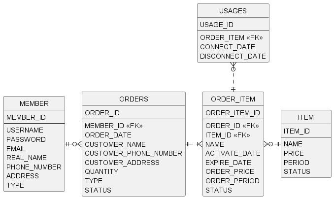

# 서버 대여 서비스 (hosting-service)
- 사용자에게 서버를 대여해 주는 프로젝트입니다. (실제로 서버를 대여해 주는 것은 아닙니다.)
- 회원 목록, 상품 목록, 주문 내역, 서버 사용 내역을 조건에 따라 조회할 수 있습니다.

## 홈페이지 화면 

## 구현 내용
- MVC 패턴 사용
- 테스트 코드 작성
- 예외처리
- 검색용 JPQL 쿼리 생성

## 배운 내용
- Mockito를 사용하면 가짜 객체를 생성하여 단위 테스트를 할 수 있음
- 도메인 모델 패턴을 사용하면 비즈니스 코드를 단순화할 수 있음
- 즉시 로딩은 예상하기 어려운 쿼리가 나가는 것이 큰 단점
- 동적 쿼리를 직접 생성하면 코드의 중복이 심함
- 엔티티에는 setter 대신 전용 메소드를 생성하는 것이 좋음
- 클래스의 필드가 많으면 빌더 패턴 고려

## 나중에 할 일
- 입력 값 검증
- 단위 테스트 코드 생성
- 로그인 세션 구현
- 사용자 권한 부여
- 회원 페이지, 관리자 페이지 구분

## 엔티티 설계

- MEMBER: 회원 엔티티입니다. 상품을 주문(대여)할 수 있고, 주문상품(서버)을 사용할 수 있습니다.
- ITEM: 상품 엔티티입니다. 상품의 정보가 주문상품(서버)에 반영됩니다.
- ORDERS: 주문(대여) 엔티티입니다. 주문한 상품의 수량에 따라 주문상품(서버)이 생성됩니다.
- ORDER_ITEM: 주문상품(서버) 엔티티입니다. 대여기간 내에 회원이 사용할 수 있습니다.
- USAGE: 사용내역 엔티티입니다. 주문상품(서버)을 사용한 정보가 기록됩니다.

## 서비스 종류
- 회원: 회원가입, 회원 조회, 회원정보 변경
- 상품: 상품 등록, 상품 조회, 상품정보 변경
- 주문: 상품 주문, 주문내역 조회
- 주문상품(서버): 서버 조회, 서버 사용, 사용 내역 조회

## 기술 스택
Spring framework, Spring boot, JPA(Hibernate)
